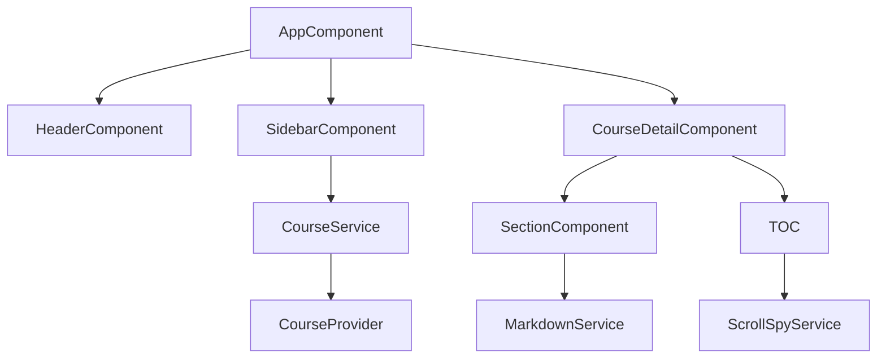
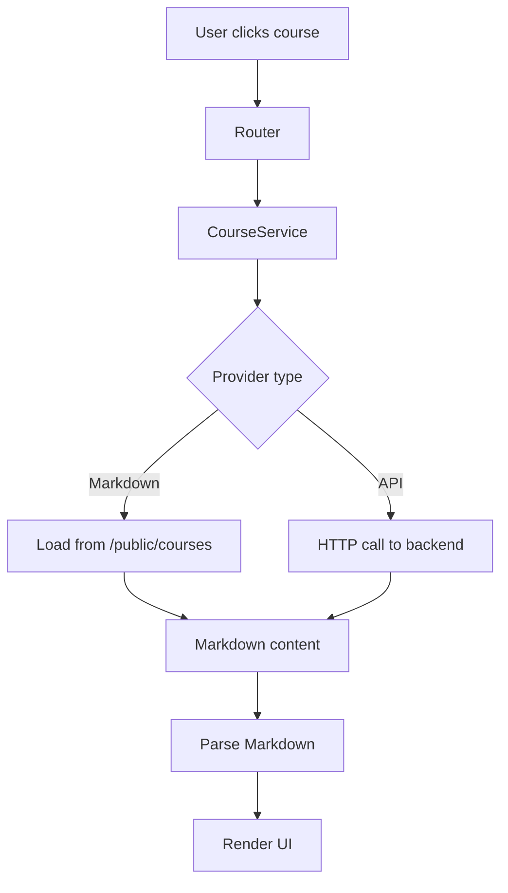
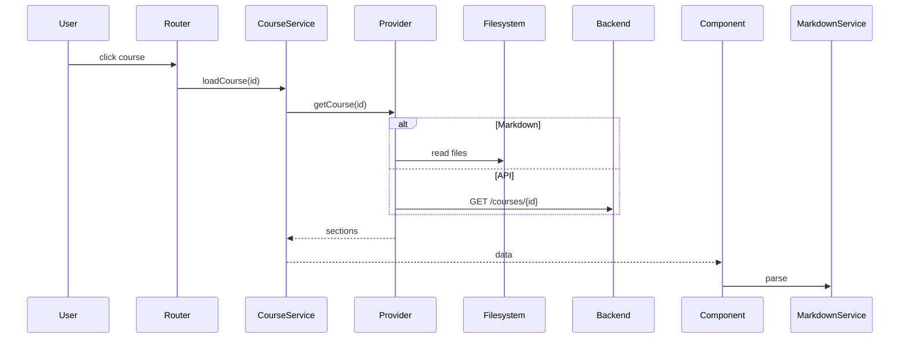
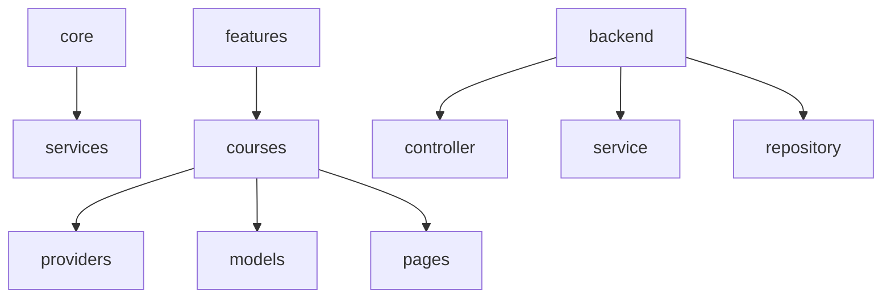

# 📐 Optimal — Fullstack UML Architecture

This document describes the scalable architecture of **Optimal**, designed to support both **static Markdown content** and a future **backend API (Java)**.

---

# 1️⃣ Application Scope

Optimal is an academic documentation platform for students and professors.

### Core Features

- Markdown-based course rendering
- Navigation (Sidebar, TOC, Breadcrumbs)
- ScrollSpy
- Search داخل content
- Theme management
- Optional backend (API + database)
- User system (future)

---

# 2️⃣ Architectural Strategy

Optimal follows a **decoupled architecture**:

- Frontend is independent from data source
- Content can come from:
  - filesystem (Markdown)
  - backend API (Java)
- Easy to switch or combine both

---

# 3️⃣ Core Entities

| Entity                | Responsibility |
|----------------------|----------------|
| Course               | Represents a course |
| Section              | Markdown-based content |
| User                 | Student / Professor |
| CourseProvider       | Abstract data source |
| MarkdownProvider     | Loads local Markdown files |
| ApiProvider          | Fetches data from backend |
| MarkdownService      | Parses Markdown |
| ScrollSpyService     | Tracks active sections |
| ThemeService         | Manages UI theme |
| BreadcrumbService    | Navigation paths |

---

# 4️⃣ Class Diagram (Frontend)

```mermaid
classDiagram

class Course {
  id: string
  title: string
  sections: Section[]
}

class Section {
  id: string
  title: string
  content: string
}

class CourseProvider {
  <<interface>>
  +getCourse(id)
}

class MarkdownProvider {
  +getCourse(id)
}

class ApiProvider {
  +getCourse(id)
}

class CourseService {
  +loadCourse(id)
}

CourseProvider <|-- MarkdownProvider
CourseProvider <|-- ApiProvider

CourseService --> CourseProvider
Course --> Section
````

---

# 5️⃣ Backend Architecture (Java)

```mermaid
classDiagram

class CourseController {
  +getCourse(id)
}

class CourseService {
  +getCourse(id)
}

class CourseRepository {
  +findById(id)
}

class CourseEntity {
  id
  title
}

class SectionEntity {
  id
  content
}

CourseController --> CourseService
CourseService --> CourseRepository
CourseRepository --> CourseEntity
CourseEntity --> SectionEntity
```

---

# 6️⃣ Component Architecture (Frontend)



---

# 7️⃣ Data Flow (Dual Source)



---

# 8️⃣ Sequence Diagram



---

# 9️⃣ Package Diagram



---

# 🔟 Key Principles

* Decoupled frontend/backend
* Pluggable data providers
* Markdown-first approach
* Backend optional
* Scalable architecture

---

# 1️⃣1️⃣ Future Backend Features

* Authentication (JWT)
* Course CRUD API
* Database (PostgreSQL / MySQL)
* Role-based access
* Admin dashboard

---

# ✅ Conclusion

Optimal is designed to evolve from:

👉 Static Markdown platform
➡️ Hybrid system
➡️ Full backend-powered application

Without rewriting the frontend.
