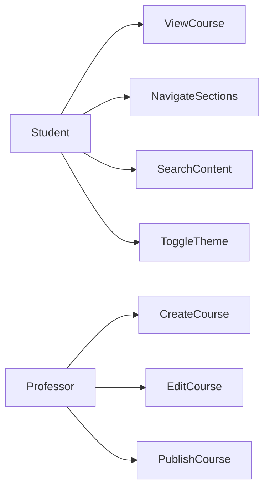
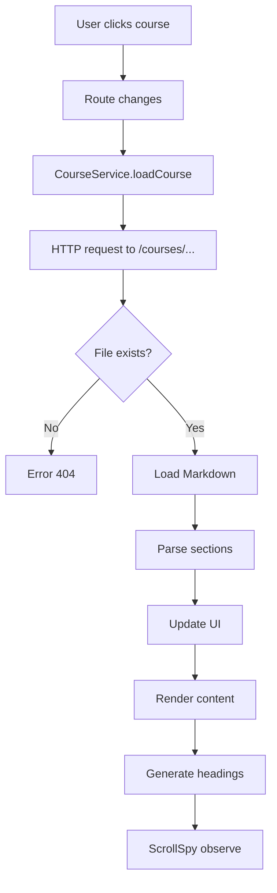
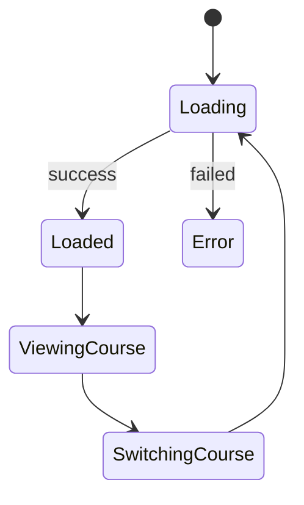
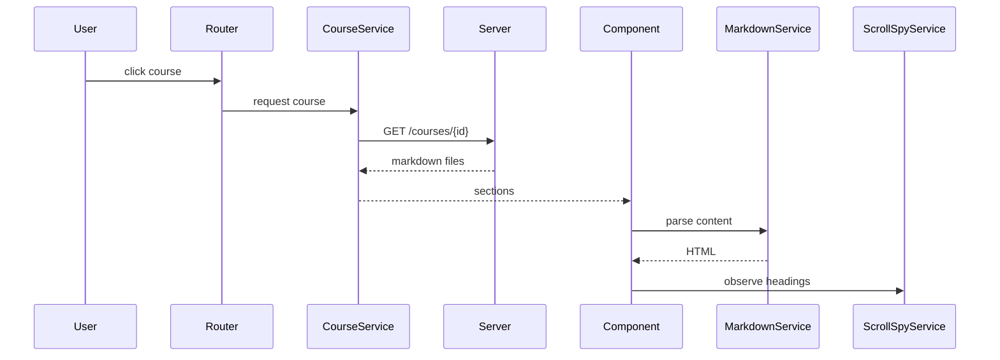
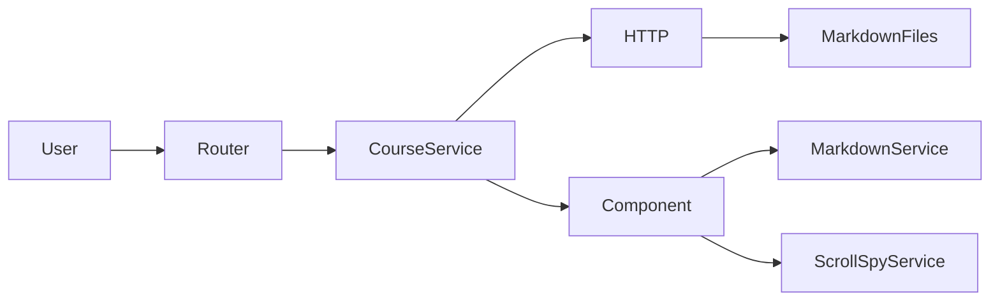
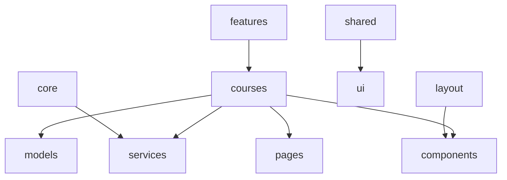

# 📐 Optimal — UML Architecture

This document describes the software architecture of **Optimal**, a modern academic documentation platform.

The goal is to provide a clear and scalable design before implementation.

---

# 1️⃣ Application Scope

**Optimal** is an academic documentation platform designed for students and professors.

### Core Features

- Course rendering (Markdown → HTML)
- Navigation (Sidebar, Table of Contents, Breadcrumbs)
- ScrollSpy (active section tracking)
- Search داخل course content
- Theme management (Dark / Light)
- User management (future extension)

---

# 2️⃣ Core Entities

| Entity                | Responsibility |
|----------------------|----------------|
| Course               | Represents a course with multiple sections |
| Section              | Represents a part of a course (Markdown content) |
| User (optional)      | Represents a student or professor |
| MarkdownService      | Parses Markdown into sanitized HTML |
| ScrollSpyService     | Tracks active section in viewport |
| ThemeService         | Handles dark/light mode |
| CourseService        | Loads course data from files |
| BreadcrumbService    | Builds navigation hierarchy |

---

# 3️⃣ Class Diagram

```mermaid
classDiagram

class Course {
  id: string
  title: string
  sections: Section[]
}

class Section {
  id: string
  title: string
  content: string
}

class CourseService {
  +loadCourse(id): Observable~Section[]~
}

class MarkdownService {
  +parse(md): string
  +getHeadings(html): Heading[]
}

class ScrollSpyService {
  +observe(ids)
  +activeId()
}

class ThemeService {
  +toggleTheme()
  +getTheme()
}

class BreadcrumbService {
  +getPath()
}

Course --> Section
CourseService --> Course
Section --> MarkdownService
ScrollSpyService --> Section
````

---

# 4️⃣ Component Architecture (Angular)

```mermaid
graph TD

AppComponent --> HeaderComponent
AppComponent --> SidebarComponent
AppComponent --> CourseDetailComponent

CourseDetailComponent --> SectionComponent
CourseDetailComponent --> TOC

SectionComponent --> MarkdownService
TOC --> ScrollSpyService

HeaderComponent --> ThemeService
SidebarComponent --> CourseService
```

---

# 5️⃣ Use Case Diagram



---

# 6️⃣ Activity Diagram (Course Loading Flow)



---

# 7️⃣ State Diagram (UI State)



---

# 8️⃣ Sequence Diagram



---

# 9️⃣ Communication Diagram



---

# 🔟 Package Diagram



---

# 1️⃣1️⃣ Key Architectural Principles

* **Separation of concerns**
* **Reactive data flow**
* **Feature-based architecture**
* **Stateless components when possible**
* **Services handle business logic**

---

# 1️⃣2️⃣ Future Improvements

* Full-text search engine
* Versioned documentation
* Collaborative editing
* API backend integration
* Role-based access (student / professor)

---

# ✅ Conclusion

This UML design provides a scalable and maintainable foundation for Optimal.

It ensures:

* clean architecture
* predictable data flow
* high performance
* extensibility

---

```


